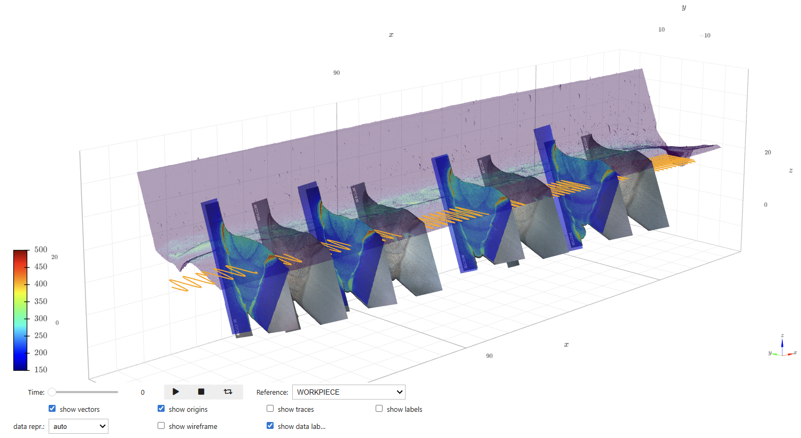
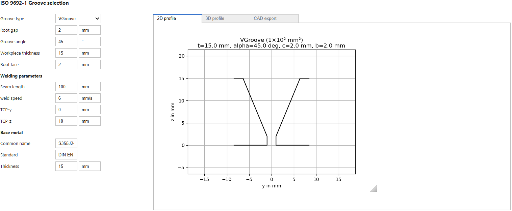
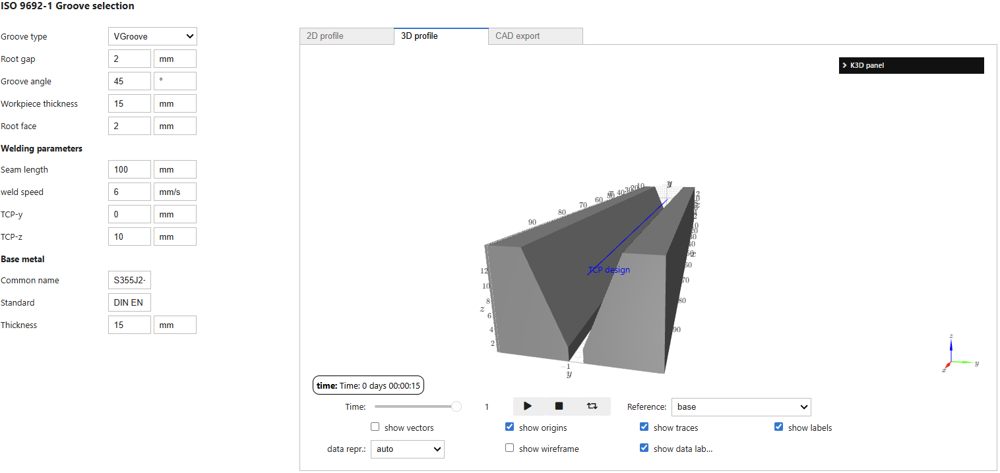

# weldx-widgets: advanced visualisation and jupyter widgets for weldx

This package provides advanced visualisation and interactive widgets for the `weldx` core package.

## Installation

```shell
pip install weldx weldx-widgets
# or
conda install weldx_widgets --channel conda-forge
```

## 3D visualisation

The `weldx-widgets` package includes 3D visualisation tools based on `k3d` for `weldx` core elements such as `weldx.SpatialData`, `weldx.LocalCoordinateSystem` and `weldx.CoordinateSystemManager`.
When installed, these plots can be enable by selecting the `backend="k3d"` in the respective `plot` functions.


*Example 3D visualisation of a `weldx`-file including geometry surface, a single TCP line, cross section images and hardness measurements*

## Interactive widgets

The `weldx-widgets` package includes forms based on `ipywidgets` to generate basic welding experimental descriptions in the `weldx` file format using graphical inputs.

### Joint Design with 3D visualisation and CAD export

```python
from weldx_widgets import WidgetGrooveSelectionTCPMovement

WidgetGrooveSelectionTCPMovement()
```

  
*Example joint configuration using interactive widgets.*

  
*Example 3D visualisation of joint and TCP design using interactive widgets.*

### Joint Design with 3D visualisation and CAD export

```python
from weldx_widgets import WidgetGMAW

WidgetGMAW()
```

  
*Example GMAW process configuration using interactive widgets.*
